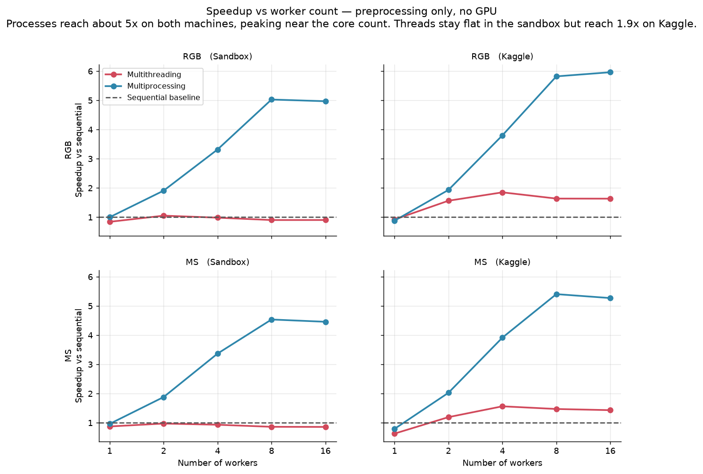
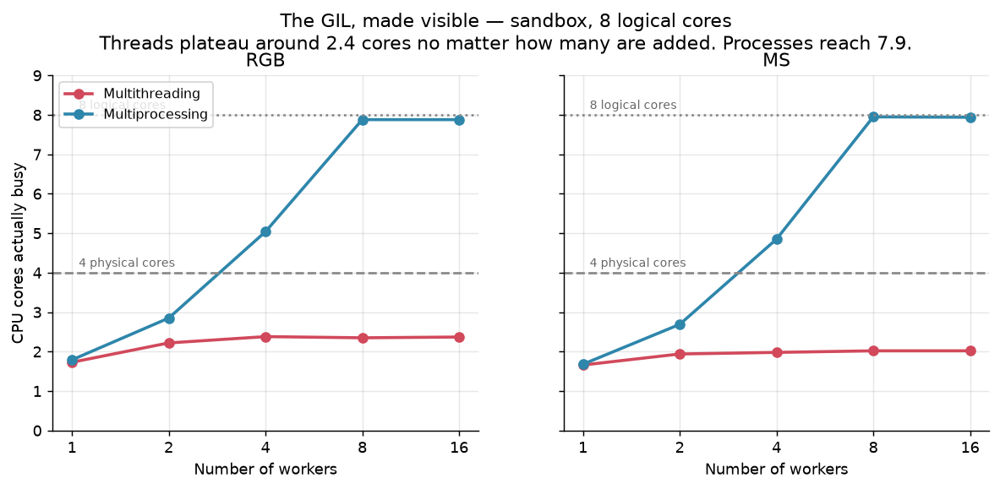
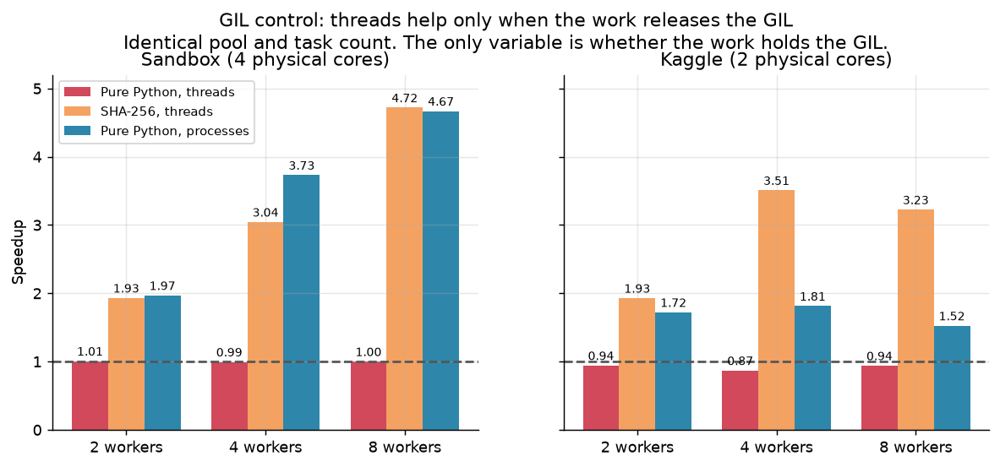
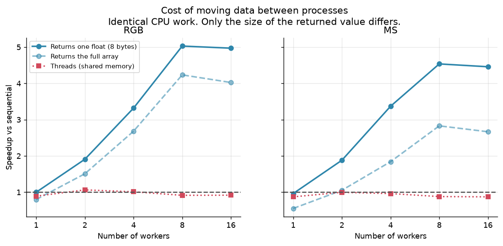
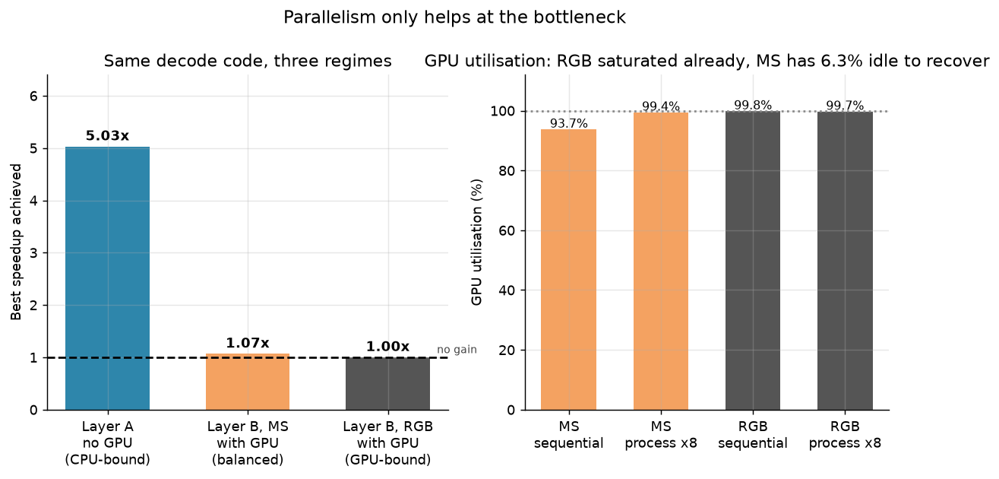
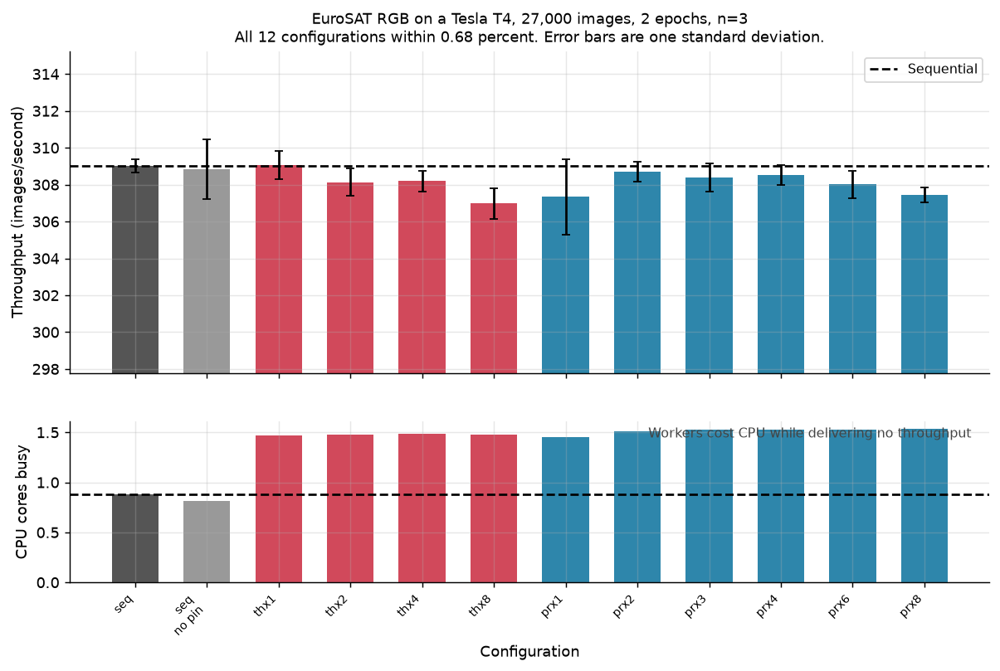
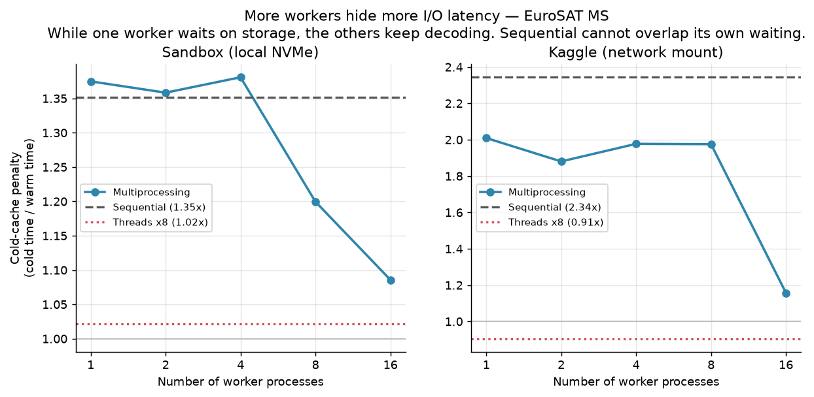
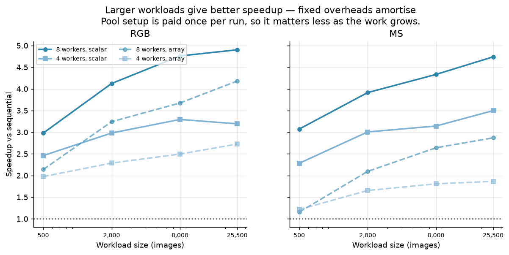
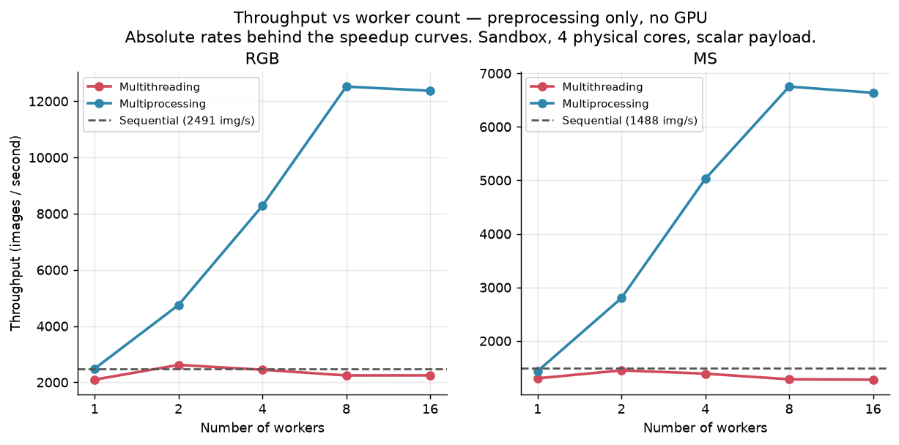
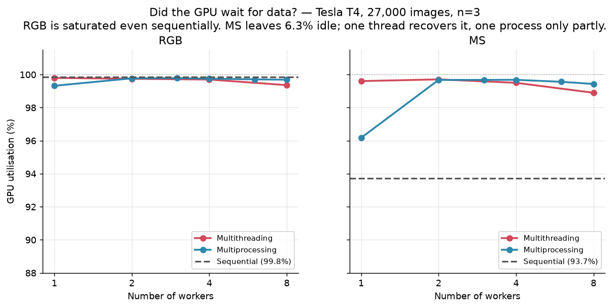

# Figures

Generated by `src/make_figures.py` from the CSVs in `results/`. Nothing is hardcoded, so rerunning picks up new data.

## 01_speedup_vs_workers.png

Speedup against worker count for both machines and both dataset variants. Multiprocessing scales to roughly 5x on both machines and then declines once the worker count passes the core count. Multithreading behaves differently on the two machines: flat near the sequential baseline in the sandbox, but rising to about 1.9x on Kaggle. The likely reason is that the Kaggle baseline is partly I/O-bound on its slower network storage, giving threads waiting to overlap, whereas the sandbox baseline was compute-saturated. The GIL control experiment in figure 3 is consistent across both machines.

## 02_busy_cores.png

CPU cores genuinely busy against worker count. Multithreading plateaus near 2.4 of 8 cores regardless of thread count, because the GIL serialises the Python portion of decoding. Multiprocessing reaches 7.9 cores. This is the mechanism behind figure 1.

## 03_gil_control.png

Control experiment isolating the GIL. A pure-Python loop holds the GIL and gains nothing from threads on either machine. SHA-256 releases it during the C call and scales nearly linearly. Processes scale on both tasks. This demonstrates the GIL as a cause rather than inferring it.

## 04_payload_ablation.png

Payload ablation. Workers perform identical CPU work but return either the decoded array or a single float, so any difference is the cost of inter-process transfer. That cost removes up to 45 percent of the achievable speedup, and is larger for MS whose arrays are 4.3 times bigger. Threads are the control: sharing memory, they are unaffected.

## 05_bottleneck_decides.png

The central result. Identical decoding code yields a 5x speedup when the CPU is the bottleneck and nothing at all when the GPU is. The right panel explains both outcomes. On RGB the GPU is already 99.8 percent busy with no workers at all, so no loader can contribute. On MS it sits at 93.7 percent, leaving 6.3 percent of idle time that workers recover, which is exactly the small gain seen in the left panel.

## 06_layerB_null_result.png

Layer B on RGB. Every configuration lands within 0.68 percent of sequential, and four are statistically slower. The lower panel shows the cost: one thread raises CPU use by 67 percent for no throughput gain, because the GPU rather than the data pipeline is the limit.

## 07_io_latency_hiding.png

Cost of an empty page cache against worker count. The penalty falls monotonically as workers are added, because workers overlap their waiting while sequential absorbs it in full. The effect is far stronger on Kaggle, whose network-mounted storage is roughly four times slower than the sandbox NVMe. Threads are almost immune, since file reads release the GIL.

## 08_workload_size.png

Speedup against workload size. Multiprocessing pays fixed costs once per run, chiefly starting the worker pool, so those costs shrink relative to the work as the dataset grows. Speedup rises with workload size in seven of the eight series; RGB with 4 workers and a scalar payload dips by 3 percent at the largest size, within run-to-run variation. The effect is strongest for the array payload on MS, climbing from 1.16x at 500 images to 2.87x at 25,500, because that configuration also carries the heaviest per-image transfer cost.

## 09_throughput_vs_workers.png

Throughput in images per second against worker count, which is the absolute measurement underlying the speedup ratios. Multiprocessing rises from roughly 2,500 to 12,500 images per second on RGB, while multithreading never moves far from the sequential line. Both peak at 8 workers, the logical core count, and flatten or fall at 16.

## 10_gpu_utilisation.png

GPU utilisation against worker count for both dataset variants. On RGB the GPU is already 99.8 percent busy with no workers at all, so there is nothing for a loader to recover. On MS sequential leaves 6.3 percent idle, because decoding a batch takes 190.6 ms against the GPU's 198.5 ms. A single thread lifts utilisation to 99.6 percent, but a single process reaches only 96.2 percent, since one worker alone cannot reliably stay ahead of the GPU at this balance point. From two workers upward both methods exceed 99 percent. This is the direct answer to whether the GPU waited for data.

